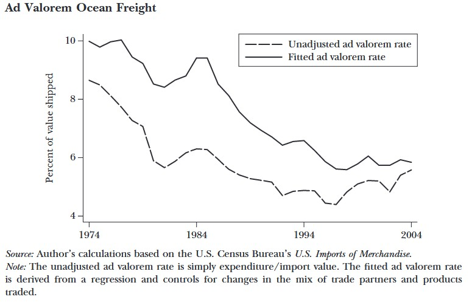
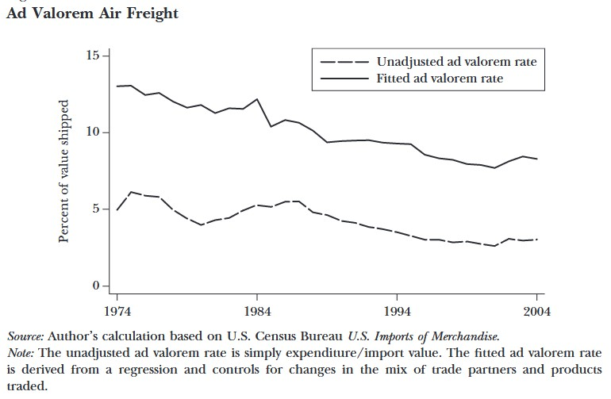
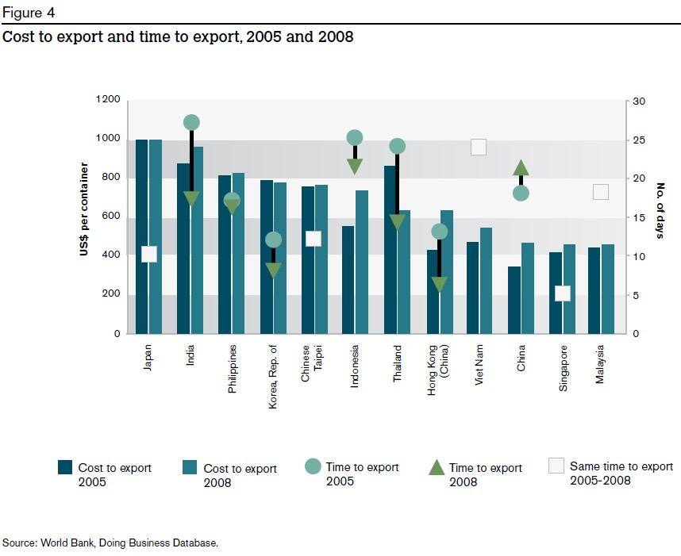
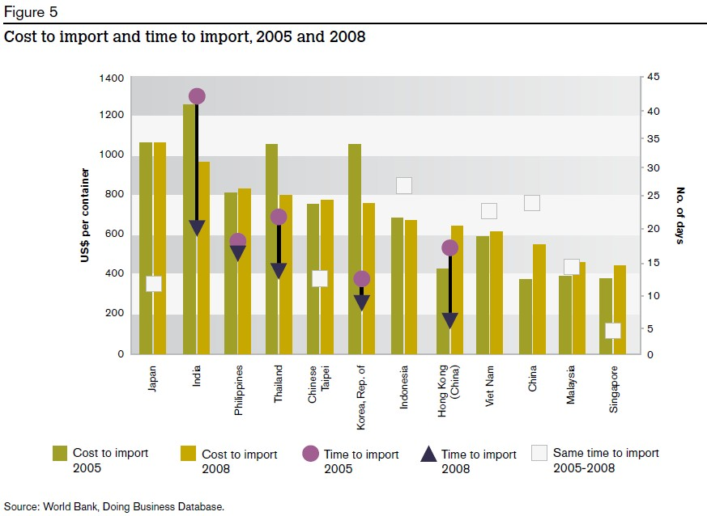
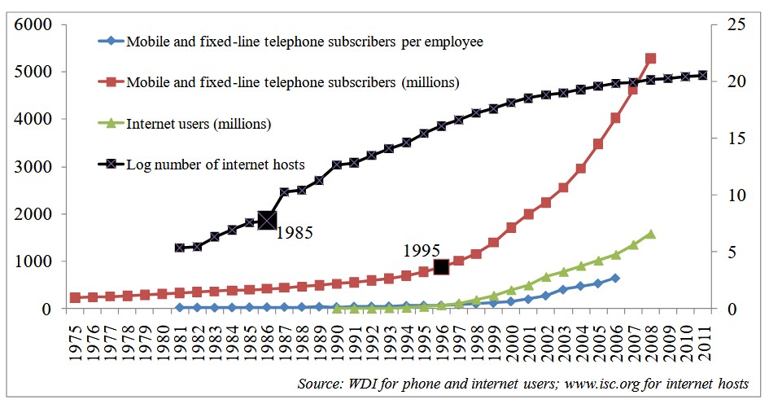

## GVC reminders

```{r}
#| label: setup
#| include: false
library(ggplot2)
library(patchwork)

# ---- palette (sampled from the original figure) ----------------------------
col_bg      <- "#C4BCC8"   # panel background
col_border  <- "#9A8FA3"
col_japan   <- "#4A66B0"
col_asia    <- "#58A5B0"   # Vietnam / ASEAN
col_west    <- "#7F8DAA"   # US, EU
col_cap     <- "#4A66B0"   # capital arrows
col_goods   <- "#58A5B0"   # goods arrows
col_inter   <- "#2A7FDB"   # intermediate goods arrows
col_loop    <- "#6FA3DC"   # goods loops

txt_size <- 7   # label size (mm); change to scale all text

# ---- helpers ---------------------------------------------------------------
arr <- arrow(length = unit(2.5, "mm"), type = "closed")

box <- function(x, y, label, fill, w = 3.2, h = 1.2, size = txt_size) {
  list(
    annotate("rect", xmin = x - w/2, xmax = x + w/2,
             ymin = y - h/2, ymax = y + h/2,
             fill = fill, colour = "#1F2F4F", linewidth = 0.8),
    annotate("text", x = x, y = y, label = label,
             colour = "white", size = size, lineheight = 0.9)
  )
}

lab <- function(x, y, label, size = txt_size)
  annotate("text", x = x, y = y, label = label, size = size, colour = "black")

arrow_seg <- function(x, y, xend, yend, colour, lw = 0.7)
  annotate("segment", x = x, y = y, xend = xend, yend = yend,
           colour = colour, linewidth = lw, arrow = arr)

loop <- function(x, y, xend, yend, curvature = -1.2)
  annotate("curve", x = x, y = y, xend = xend, yend = yend,
           curvature = curvature, ncp = 15,
           colour = col_loop, linewidth = 0.7, arrow = arr)

# simple factory icon, centred at (cx, cy); s = scale
factory <- function(cx, cy, s = 1) {
  x0 <- cx - 0.9*s; y0 <- cy - 0.6*s
  list(
    # chimney
    annotate("polygon",
             x = x0 + s*c(0.05, 0.05, 0.30, 0.30),
             y = y0 + s*c(0.0, 1.5, 1.5, 0.0),
             fill = "white", colour = "black", linewidth = 0.7),
    # building with saw-tooth roof
    annotate("polygon",
             x = x0 + s*c(0.05, 0.05, 0.75, 1.20, 1.20, 1.80, 1.80),
             y = y0 + s*c(0.0, 0.65, 0.65, 0.95, 0.65, 0.95, 0.0),
             fill = "white", colour = "black", linewidth = 0.7),
    # windows
    annotate("rect",
             xmin = x0 + s*c(0.20, 0.70, 1.20),
             xmax = x0 + s*c(0.60, 1.10, 1.60),
             ymin = y0 + s*0.12, ymax = y0 + s*0.40,
             fill = "white", colour = "black", linewidth = 0.6)
  )
}

panel <- function(title, xlim, ylim, ...) {
  ggplot() +
    annotate("text", x = mean(xlim), y = ylim[2] - 0.35, label = title,
             fontface = "bold", size = txt_size + 2) +
    list(...) +
    coord_cartesian(xlim = xlim, ylim = ylim, expand = FALSE) +
    theme_void() +
    theme(
      panel.background = element_rect(fill = col_bg, colour = NA),
      plot.background  = element_rect(fill = col_bg, colour = col_border,
                                      linewidth = 1.2)
    )
}
```

```{r}
#| label: fig-gvc-fdi
#| echo: false
#| warning: false
#| fig-cap: Vertical FDI, export-platform FDI and global value chains
#| fig-height: 6.5
#| fig-width: 14

# ---- (a) Vertical FDI -------------------------------------------------------
p_vertical <- panel(
  "Vertical FDI", xlim = c(0, 10), ylim = c(0, 6),
  box(1.7, 3.0, "Japan", col_japan),
  box(7.9, 4.3, "Vietnam", col_asia),
  factory(7.9, 1.9, 1.1),
  arrow_seg(3.5, 3.5, 6.1, 3.5, col_cap),
  lab(4.8, 4.15, "capital"),
  arrow_seg(6.1, 2.8, 3.5, 2.8, col_goods),
  lab(4.8, 2.1, "goods")
)

# ---- (b) Export-platform FDI ------------------------------------------------
p_export <- panel(
  "Export Platform FDI", xlim = c(0, 10), ylim = c(0, 6.5),
  box(1.7, 4.4, "Japan", col_japan),
  box(7.7, 4.4, "Vietnam", col_asia),
  box(1.7, 1.0, "US, EU\u2026", col_west),
  factory(7.7, 2.2, 1.0),
  arrow_seg(3.5, 4.0, 6.0, 4.0, col_cap),
  lab(4.7, 4.9, "capital"),
  arrow_seg(6.0, 3.3, 3.5, 3.3, col_goods),
  lab(4.7, 2.7, "goods"),
  arrow_seg(6.3, 1.9, 3.5, 0.9, col_goods),
  lab(5.4, 0.55, "goods")
)

# ---- (c) Global value chain -------------------------------------------------
p_gvc <- panel(
  "Global Value Chain", xlim = c(0, 12), ylim = c(0, 10),
  # nodes
  box(2.0, 3.9, "Japan", col_japan, w = 3.2),
  box(8.4, 7.7, "ASEAN,\nChina\u2026", col_asia, w = 3.0, h = 1.8),
  box(8.4, 2.0, "Vietnam", col_asia, w = 3.0),
  box(2.0, 1.4, "US, EU\u2026", col_west, w = 3.2),
  factory(10.9, 7.4, 1.0),
  factory(10.9, 2.1, 1.0),
  # Japan <-> ASEAN, China
  arrow_seg(3.4, 5.4, 6.5, 7.0, col_cap),
  lab(4.8, 7.0, "capital"),
  arrow_seg(6.5, 6.5, 3.6, 5.0, col_goods),
  lab(6.0, 5.5, "goods"),
  # Japan <-> Vietnam
  arrow_seg(3.6, 3.7, 6.5, 3.7, col_cap),
  lab(5.0, 4.4, "capital"),
  arrow_seg(6.5, 2.9, 3.6, 2.9, col_goods),
  lab(5.0, 2.2, "goods"),
  # intermediate goods, ASEAN/China <-> Vietnam
  arrow_seg(7.7, 3.0, 7.7, 6.6, col_inter, lw = 0.9),
  arrow_seg(8.4, 6.4, 8.4, 3.2, col_inter, lw = 0.9),
  lab(10.0, 4.8, "intermediate goods"),
  # Vietnam -> US, EU
  arrow_seg(6.5, 1.9, 3.7, 1.0, col_goods),
  # within-region goods loops
  loop(9.6, 6.7, 8.4, 8.8),
  lab(11.0, 9.0, "goods"),
  loop(9.4, 1.0, 8.4, 2.7, curvature = 1.2),
  lab(10.9, 0.5, "goods"),
  # note
  annotate("text", x = 0.2, y = 0.15, hjust = 0, size = 3.2,
           label = "Note: Investment from other countries than Japan is omitted in the graph for better illustration.")
)

# ---- layout: two stacked panels on the left, GVC on the right --------------
((p_vertical / p_export) | p_gvc) +
  plot_layout(widths = c(1, 1.45))
```


## What make GVCs

- What are the conditions that allow firms to separate production and consumption and different tasks in supply chain ?

- Declining trade costs: trade policy, tariff and non-tariff barrier, transport and logistics
  
- Declining coordination costs: investment policy, ICT, movement of people, institution

## Effects of Trade Costs on Bilateral Trade

```{r}
#| label: fig-gravity
#| fig-cap: "Gravity coefficient estimates"
#| fig-width: 9
#| fig-height: 6
#| echo: false
#| warning: false

library(data.table)
library(ggpubr)

gravity <- data.table(
  variable = c(
    "Origin GDP",
    "Destination GDP",
    "Distance",
    "Home",
    "Contiguity",
    "Common language",
    "Colonial link",
    "RTA/FTA",
    "EU",
    "NAFTA",
    "Common currency"
  ),
  
  block = c(
    rep("Size and distance", 4),
    rep("Trade-cost dummies", 7)
  ),
  
  All_median = c(
     0.97,  0.85, -0.89, 1.93,
     0.49,  0.49,  0.91, 0.47,
     0.23,  0.39,  0.87
  ),
  
  All_sd = c(
    0.42, 0.28, 0.40, 1.28,
    0.57, 0.44, 0.61, 0.50,
    0.56, 0.67, 0.48
  ),
  
  Structural_median = c(
     0.86,  0.67, -1.14, 1.55,
     0.52,  0.33,  0.84, 0.28,
     0.19,  0.53,  0.98
  ),
  
  Structural_sd = c(
    0.45, 0.41, 0.41, 1.68,
    0.65, 0.29, 0.49, 0.42,
    0.50, 0.64, 0.39
  )
)

gravity_long <- melt(
  gravity,
  id.vars = c("variable", "block"),
  measure.vars = patterns(
    median = "_median$",
    sd = "_sd$"
  ),
  variable.name = "sample"
)

gravity_long[
  , sample := factor(
    sample,
    levels = 1:2,
    labels = c("All gravity", "Structural gravity")
  )
]

ggplot(gravity_long, aes(x = median, y = variable, colour = sample)) +
  geom_vline(xintercept = 0, linetype = "dashed", colour = "grey50") +
  geom_pointrange(
    aes(xmin = median - sd, xmax = median + sd),
    position = position_dodge(width = 0.6),
    size = 0.6, linewidth = 0.8
  ) +
  facet_grid(block ~ ., scales = "free_y", space = "free_y") +
  scale_colour_manual(values = c("All gravity" = "#7f7f7f", "Structural gravity" = "#c0392b")) +
  labs(x = "Coefficient estimate (median ± 1 s.d.)", y = NULL, colour = NULL,
       caption = "Head and Mayers (2014). Notes:2,508 estimates from 159 papers.Structural gravity = some use of country fixed effects or ratio-type method.") +
  theme_minimal(base_size = 16) +
  theme(
    legend.position = "top",
    panel.grid.major.y = element_blank(),
    strip.text = element_text(face = "bold", hjust = 0),
    plot.caption = element_text(hjust = 0, size = 8)
  )
```

## WTO and multilaterism

<div style="font-size:70%">
- **1948–49**: GATT launched with 23 members; +11 accessions  
- **1950s**: +15 accessions, 2 successions, 4 withdrawals  
- **1960s**: +12 accessions, 21 successions  
- **1970s**: +9 accessions, 4 successions  
- **1980s**: +6 accessions, 5 successions  
- **1990–94**: +9 accessions, 20 successions  
- **1995**: WTO established  
- **1996–2000**: 11 accessions (Bulgaria, Ecuador, Mongolia, Kyrgyz Rep., etc.)  
- **2001–05**: 7 major accessions (China, Lithuania, Moldova, Chinese Taipei, Saudi)  
- **2006–12**: 10 accessions (Viet Nam, Ukraine, Russia, Samoa, Vanuatu)  
</div>

## WTO challenge

```{r}
#| echo: false
#| warning: false

wto_power = fread("../data/04_gvc_enablers/wto_power.csv")
wto_power[,year:=as.character(year)]
wto_power[,label:=ifelse(gdp_share>1.6|global_trade_share>0.05,
                         iso3c,"")]
ggscatter(wto_power,
                  x="gdp_share",xlab="Trade Share in GDP",
                  y="global_trade_share",
                  ylab = "Trade Share in Global Trade",
                  color = "year",
                  label = wto_power$label,
                  repel = T)
```

## Regional and bilateral agreements

```{r}
#| echo: false
#| message: false
#| warning: false

path <- "../data/04_gvc_enablers/RTAIS_Evolution_Dashboard_2026_10_06_08_49_20.csv"  

# --- Load: find the header row, keep only the year rows -----------------------
raw <- fread(path)
hdr <- which(grepl("Year of entry", raw[[1]]))[1]

dt <- raw[(hdr + 1):.N, 1:6]
setnames(dt, c("year", "goods", "services", "accessions", "cum_notif", "cum_rtas"))
dt[, (names(dt)) := lapply(.SD, function(x) suppressWarnings(as.numeric(x)))]
dt <- dt[!is.na(year)]

# --- Bars: long format (first factor level is stacked on top) -----------------
bar_levels <- c("Accessions to an RTA", "Services notifications", "Goods notifications")
bars <- melt(dt, id.vars = "year",
             measure.vars = c("goods", "services", "accessions"),
             variable.name = "type", value.name = "n")
bars[, type := factor(type,
                      levels = c("accessions", "services", "goods"),
                      labels = bar_levels)]

# --- Lines: right axis is left axis x 10 (0-75 vs 0-750), so scale by 1/10 ----
k <- 10
lines <- melt(dt[, .(year,
                     `Cumulative Number of RTAs in force`        = cum_rtas  / k,
                     `Cumulative Notifications of RTAs in force` = cum_notif / k)],
              id.vars = "year", variable.name = "series", value.name = "y")

# --- Plot ---------------------------------------------------------------------
ggplot() +
  geom_col(data = bars, aes(year, n, fill = type), width = 0.6) +
  geom_line(data = lines, aes(year, y, colour = series, linewidth = series)) +
  scale_fill_manual(
    values = c("Goods notifications"    = "#1F5BCC",
               "Services notifications" = "#D02040",
               "Accessions to an RTA"   = "#FFC000"),
    breaks = c("Goods notifications", "Services notifications", "Accessions to an RTA")) +
  scale_colour_manual(
    values = c("Cumulative Number of RTAs in force"        = "black",
               "Cumulative Notifications of RTAs in force" = "#A8A020")) +
  scale_linewidth_manual(
    values = c("Cumulative Number of RTAs in force"        = 1.1,
               "Cumulative Notifications of RTAs in force" = 0.8)) +
  scale_x_continuous(breaks = seq(dt[, min(year)], dt[, max(year)], by = 2),
                     expand = expansion(add = 1)) +
  scale_y_continuous(
    name = "Number per year",
    limits = c(0, 75), breaks = c(0, 25, 50, 75),
    expand = expansion(mult = c(0, 0.02)),
    sec.axis = sec_axis(~ . * k, name = "Cumulative Number",
                        breaks = c(0, 250, 500, 750))) +
  labs(title = sprintf("RTAs currently in force (by year of entry into force), %d - %d",
                       dt[, min(year)], dt[, max(year)]),
       x = NULL, fill = NULL, colour = NULL, linewidth = NULL,
       caption = paste("Note: goods, services & accessions to an RTA are counted separately.",
                       "Cumulative lines show the number of RTAs/notifications currently in force.",
                       "Source: WTO Secretariat, RTA-IS.", sep = "\n")) +
  guides(fill = guide_legend(order = 1, ncol = 1),
         colour = guide_legend(order = 2, ncol = 1),
         linewidth = guide_legend(order = 2, ncol = 1)) +
  theme_minimal(base_size = 12) +
  theme(plot.title = element_text(face = "bold", size = 13),
        plot.caption = element_text(hjust = 0, size = 9),
        plot.title.position = "plot",
        plot.caption.position = "plot",
        axis.text.x = element_text(angle = 90, vjust = 0.5, hjust = 1),
        axis.title.y.left  = element_text(face = "italic"),
        axis.title.y.right = element_text(face = "italic"),
        panel.grid.minor = element_blank(),
        panel.grid.major.x = element_blank(),
        legend.position = "bottom",
        legend.box = "horizontal")
```

## Regional and bilateral agreements (cont.)

```{r}
#| echo: false
#| message: false
#| warning: false

path <- "../data/04_gvc_enablers/RTAIS_Regional_2026_10_06_09_04_54.csv"

# --- Load: find the header row ("Region"), keep the rows below it ---------------
raw <- fread(path)
hdr <- which(raw[[1]] == "Region")[1]

dt <- raw[(hdr + 1):.N, 1:2]
setnames(dt, c("region", "n"))
dt[, n := suppressWarnings(as.numeric(n))]
dt <- dt[!is.na(region) & !is.na(n)]
dt[, region := factor(region, levels = dt[order(n), region])]  # largest bar on top

# --- Plot ----------------------------------------------------------------------
ggplot(dt, aes(region, n)) +
  geom_col(fill = "#1F5BCC", width = 0.7) +
  geom_text(aes(label = n), hjust = -0.2, size = 3.8) +
  coord_flip() +
  scale_y_continuous(expand = expansion(mult = c(0, 0.08))) +
  labs(title = "Notified RTAs in force, participation by region",
       x = NULL, y = "Notifications of RTAs in force",
       caption = paste("Note: RTAs involving countries/territories in two (or more) regions",
                       "are counted more than once.",
                       "Source: WTO Secretariat, RTA-IS.", sep = "\n")) +
  theme_minimal(base_size = 12) +
  theme(plot.title = element_text(face = "bold", size = 13),
        plot.title.position = "plot",
        plot.caption = element_text(hjust = 0, size = 9),
        plot.caption.position = "plot",
        axis.title.x = element_text(face = "italic"),
        panel.grid.major.y = element_blank(),
        panel.grid.minor = element_blank())
```


## MFN tariff rates


## Applied tariff rates (cont.)

```{r}
#| echo: false
#| message: false
#| warning: false
wto_tariff = fread("../data/04_gvc_enablers/wto_tariff.csv")
ggline(wto_tariff,
       x="year",xlab="",
       y="value",
       ylab = "Tariff (%)",
       color = "indicator") +
  guides(color=guide_legend(nrow=3))
```

## Non-tariff measures

<div style="font-size:50%">
**Technical measures**  
A. Sanitary & phytosanitary (SPS)  
B. Technical barriers to trade (TBT)  
C. Pre-shipment inspection & formalities  

**Non-technical measures**  
D. Contingent trade-protective (anti-dumping, safeguards)  
E. Non-automatic licensing, quotas, prohibitions  
F. Price-control measures (taxes, charges)  
G. Finance measures  
H. Competition-related restrictions  
I. Trade-related investment measures  
J. Distribution restrictions  
K. Post-sales service restrictions  
L. Subsidies & other support  
M. Government procurement restrictions  
N. Intellectual property rules  
O. Rules of origin  

**Export measures**  
P. Export-related measures
</div>

## Non-tariff measures by sector

```{r}
#| echo: false
#| message: false
#| warning: false

ntm <- data.table(
  Country = c(
    "Japan", "US",
    "Japan", "Japan", "Japan",
    "US", "US", "US",
    "Japan", "Japan", "Japan", "Japan", "Japan", "Japan",
    "US", "US", "US", "US", "US", "US"
  ),

  Group = c(
    "Overall", "Overall",
    rep("Sector", 6),
    rep("Measure", 12)
  ),

  Category = c(
    "Overall", "Overall",

    "Agriculture",
    "Manufacturing",
    "Natural Resources",
    "Agriculture",
    "Manufacturing",
    "Natural Resources",

    "SPS",
    "TBT",
    "Pre-Shipment",
    "Quantity",
    "Price Control",
    "Export Measures",

    "SPS",
    "TBT",
    "Pre-Shipment",
    "Quantity",
    "Price Control",
    "Export Measures"
  ),

  Frequency = c(
    96, 76,
    100, 96, 100,
    100, 73, 100,
    13, 96, 11, 42, 15, 98,
    14, 72, 12, 14, 16, 21
  ),

  Coverage = c(
    99, 87,
    100, 99, 100,
    100, 85, 100,
    11, 99, 23, 54, 48, 90,
    13, 85, 13, 27, 16, 38
  ),

  Prevalence = c(
    6.0, 4.5,
    9.7, 5.6, 4.9,
    19.9, 2.6, 2.4,
    0.8, 4.4, 0.1, 0.5, 0.3, 1.9,
    1.6, 2.4, 0.1, 0.1, 0.2, 0.5
  )
)

ntm_long <- melt(
  ntm,
  id.vars = c("Country", "Group", "Category", "Prevalence"),
  measure.vars = c("Frequency", "Coverage"),
  variable.name = "Indicator",
  value.name = "Value"
)

dt_sector <- ntm_long[Group == "Sector"]

dt_sector[, Category := factor(
  Category,
  levels = rev(c(
    "Agriculture",
    "Manufacturing",
    "Natural Resources"
  ))
)]

dt_sector[, Indicator := factor(
  Indicator,
  levels = c("Frequency", "Coverage"),
  labels = c("Frequency Index", "Coverage Ratio")
)]

ggplot(
  dt_sector,
  aes(
    x = Value,
    y = Category,
    fill = Country
  )
) +
  geom_col(
    position = position_dodge(width = 0.7),
    width = 0.6
  ) +
  geom_text(
    aes(label = paste0(Value, "%")),
    position = position_dodge(width = 0.7),
    hjust = -0.15,
    size = 3.5
  ) +
  facet_wrap(~ Indicator, nrow = 1) +
  scale_x_continuous(
    limits = c(0, 110),
    breaks = seq(0, 100, 20)
  ) +
  labs(
    title = "NTM Incidence by Sector",
    subtitle = "Japan vs United States",
    x = "Percent",
    y = NULL,
    fill = NULL,
    caption = "Source: UNCTAD\n Agriculture: HS1-24, NR: 25-27, Manuf: 28-97"
  ) +
  theme_minimal(base_size = 12) +
  theme(
    panel.grid.major.y = element_blank(),
    panel.grid.minor = element_blank(),
    legend.position = "top",
    strip.text = element_text(face = "bold"),
    plot.title = element_text(face = "bold")
  )

```


## Non-tariff measures by type


```{r}
#| echo: false
#| message: false
#| warning: false

dt_measure <- ntm_long[Group == "Measure"]

dt_measure[, Category := factor(
  Category,
  levels = rev(c(
    "SPS",
    "TBT",
    "Pre-Shipment",
    "Quantity",
    "Price Control",
    "Export Measures"
  ))
)]

dt_measure[, Indicator := factor(
  Indicator,
  levels = c("Frequency", "Coverage"),
  labels = c("Frequency Index", "Coverage Ratio")
)]

ggplot(
  dt_measure,
  aes(
    x = Value,
    y = Category,
    fill = Country
  )
) +
  geom_col(
    position = position_dodge(width = 0.7),
    width = 0.6
  ) +
  geom_text(
    aes(label = paste0(Value, "%")),
    position = position_dodge(width = 0.7),
    hjust = -0.15,
    size = 3.5
  ) +
  facet_wrap(~ Indicator, nrow = 1) +
  scale_x_continuous(
    limits = c(0, 110),
    breaks = seq(0, 100, 20)
  ) +
  labs(
    title = "NTM Incidence by Type of Measure",
    subtitle = "Japan vs United States",
    x = "Percent",
    y = NULL,
    fill = NULL,
    caption = "Souce: UNCTAD"
  ) +
  theme_minimal(base_size = 12) +
  theme(
    panel.grid.major.y = element_blank(),
    panel.grid.minor = element_blank(),
    legend.position = "top",
    strip.text = element_text(face = "bold"),
    plot.title = element_text(face = "bold")
  )
```

## Tariff equivalence of Non-tariff measures 

```{r}
#| echo: false
#| message: false
#| warning: false

dt_plot <- fread("../data/04_gvc_enablers/ntm_japan_world_by_sector.csv")

dt_long <- melt(
  dt_plot,
  id.vars = c("gtap_code", "gtap_desc"),
  measure.vars = c("Japan", "USA","World"),
  variable.name = "region",
  value.name = "value"
)

dt_long[, sector := factor(
  gtap_desc,
  levels = rev(dt_plot$gtap_desc)
)]

ggplot(
  dt_long,
  aes(x = sector, y = value, fill = region)
) +
  geom_col(
    position = "dodge",
    width = 0.7
  ) +
  #coord_flip() +
  labs(
    x = NULL,
    y = "Average NTM",
    fill = NULL,
    #title = "NTMs by Sector: Japan vs. World Average",
    caption = "Source: World Bank - GTAP"
  ) +
  theme_minimal(base_size = 11) +
  theme(
    legend.position = "top",
    panel.grid.major.y = element_blank(),
    axis.text.x = element_text(size = 8,angle = 90),
    plot.title = element_text(face = "bold", size = 14)
  )
```


## International transportation costs: Ocean



::: notes
- Transport Infrastructure: ports, airports, rail/road connectivity.
- Digital Infrastructure: broadband, cloud computing, digital platforms enabling services trade.
- Case example: 
  - Container development
  - Singapore and logistics connectivity
  - Japan’s port investments in ASEAN
:::

## International transportation costs: Air



## Investment treaties


::: notes
- Investment policy
 - FDI openness, 
 - Investor protections
 - Rule of law
:::

## Export processing zones

- labor: relatively low wage
- infrastructure: reliable power and logistics efficiency
- tax incentives


## Custom procedures

::: columns
::: column

:::
::: column

:::
:::

## Internet access



## Key takeaways

- Declining trade costs: trade policy, tariff and non-tariff barrier, transport and logistics
  
- Declining coordination costs: investment policy, ICT, movement of people, institution


---
## References
<div style="font-size:50%">
- Baldwin, R. (2011). 21st Century Regionalism: Filling the gap between 21st century trade and 20th century trade rules.
- Head, K., & Mayer, T. (2014). Gravity Equations: Workhorse,Toolkit, and Cookbook. In Handbook of International Economics (Vol. 4, pp. 131–195).
- Hummels, D. (2007). Transportation Costs and International Trade in the Second Era of Globalization. Journal of Economic Perspectives, 21(3), 131–154. 
- Kimura and Chen (2016), Implications of Mega Free Trade Agreements for Asian Regional Integration and RCEP Negotiation.  
- WTO and JETRO-IDE (2011), Trade patterns and global value chains in East Asia: from trade in goods to trade in tasks. 
- Data links
  - https://ttd.wto.org/en
  - https://www.macmap.org/
  - https://www.wto.org/english/res_e/statis_e/tariff_profiles_list_e.htm
  - https://rtais.wto.org/
  - https://unctad.org/topic/trade-analysis/non-tariff-measures/NTMs-data
  - https://wits.worldbank.org/tariff/non-tariff-measures
  - https://datacatalog.worldbank.org/search/dataset/0040437/ad-valorem-equivalent-of-non-tariff-measures
</div>

