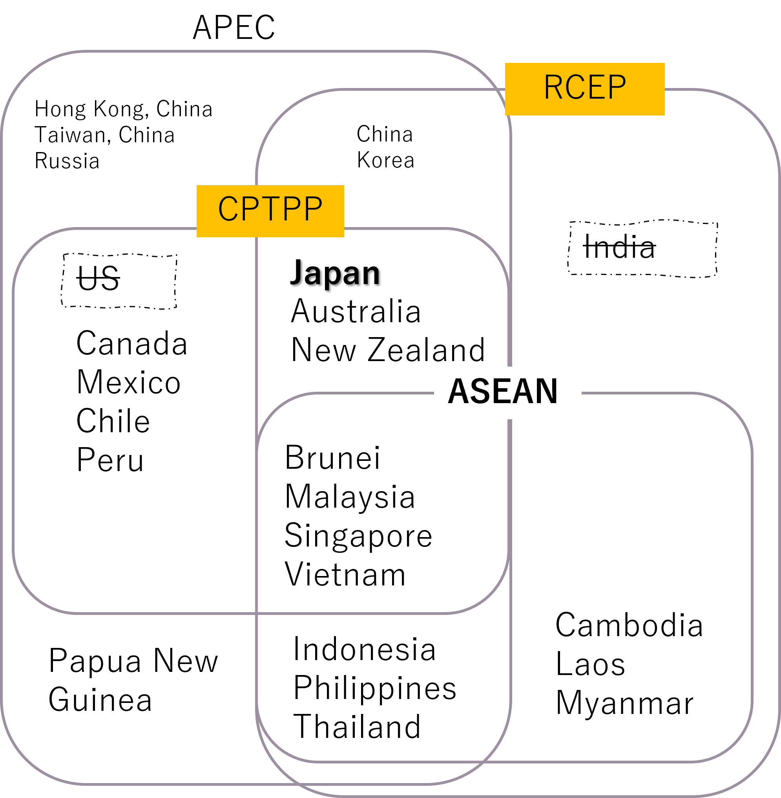
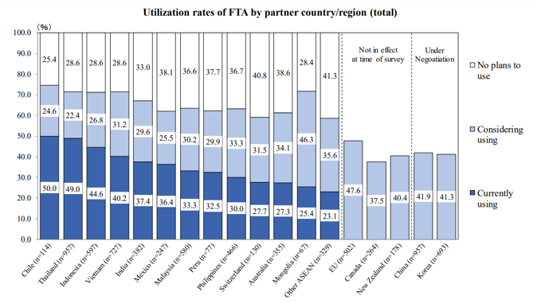

```{r}
#| include: false
library(data.table)
library(ggpubr)
asean5 = c("IDN","THA","MYS","PHL","SGP")
asean_new = c("VNM","LAO","KHM","MMR")
asean_other = c("BRN","TLS")
asean_all = c(asean5,asean_new,asean_other)
```

## Introduction

- About ASEAN
- ASEAN Economic Integration
- ASEAN and Japan

## ASEAN at a glance

```{r}
pwt2 = fread("../data/05 asean/asean_gdp.csv")
unpop = fread("../data/05 asean/asean_pop.csv")
unpop[,pop:=pop/10^3] ## milllion

ggarrange(
 ggbarplot(pwt2[ISOcode%in%asean_all
                 &grepl("Real GDP",Variablename2),
               .(Country=ISOcode,
                 value=value/10^6,
                 date)],
          x="date",y="value",
          xlab="",ylab = "Real GDP (tri. USD)",
          color = "Country",
          fill = "Country") +
  geom_line(data=pwt2[ISOcode%in%"JPN"
                 &grepl("Real GDP",Variablename2)],
            aes(x=date,y=value/10^6),
            color="black"),
  ggbarplot(unpop[date<=2050&Region%in%asean_all],
         x="date",y="pop",
         ylab="Population (mil ppl.)",
         color="Region",
         fill="Region") +
   geom_line(data=unpop[date<=2050&Region%in%"JPN"],
            aes(x=date,y=pop),
            color="black"),
  ggline(unpop[date<=2050&Region%in%asean_all],
         x="date",y="MedianAgePop",
         xlab="",
         color="Region") +
    geom_line(data=unpop[date<=2050&Region%in%"JPN"],
            aes(x=date,y=MedianAgePop),
            color="black"),
  ggline(unpop[date<=2050&Region%in%asean_all],
         x="date",y="NatChangeRT",
         xlab="",
         color="Region",
         caption = "Source: PWT 10, UN World Population Prospect") +
   geom_line(data=unpop[date<=2050&Region%in%"JPN"],
            aes(x=date,y=NatChangeRT),
            color="black"),
  common.legend = T,
 align = "h"
)

```

## ASEAN Diversity (1)  {.r-fit-text}

- Established in 1967 in by the original five members: Indonesia, Malaysia, Philippines, Singapore and Thailand (ASEAN5)

- Others joined in 1984 and 1990s
  - Timor-Leste as observer since 2022, formal affirmed in October 2025.

- ASEAN Charter effective since 2008, aiming for ASEAN Community

- With the principle of “non-intervention”, ASEAN has never aspired to be a European Union

## ASEAN Diversity (2)

```{r}
gdppc = fread("../data/05 asean/asean_gdppc.csv")
ggscatter(gdppc,
          x="Y1985",y="Y2019",
          xlab="Real GDP per capita in 1985 (USD)",
          ylab="Real GDP per capita in 2019 (USD)",
          size = gdppc$growth,
          color = "group",
          label = gdppc$Region,
          repel = T,
          caption="Source: PWT 10, UN population prospect") +
  scale_x_continuous(transform = "sqrt") +
  scale_y_continuous(transform = "sqrt") 
```
::: notes
- ASEAN total real GDP PPP increased almost 4 times since 1993, still gaps in GDP per capita among member countries
:::

## ASEAN Economic Integration  (1)

- In the 1970s: ASEAN5 pursued an import substitution industrialization strategy with prohibitively high tariffs

- In the 1980s: ASEAN5 moved toward an export-oriented industrialization strategy

- Brand to Brand Complementation (BBC) in 1988: 
  - reduced tariffs on auto parts by 50% in intra-firm trade in the ASEAN region
  - proposed by Mitsubishi Motors but also used by other Japanese automobile manufacturers

## ASEAN Economic Integration  (2a) 

- In 1990s: full-scale trade liberalization 
  - ASEAN Industrial Cooperation (AICO) in 1996
    - cover items other than automobile parts 
    - tariff of 0–5% to intra-company trade
    - used mostly by Japanese companies in the automobile and electric industry

## ASEAN Economic Integration  (2b) 
  - ASEAN Free Trade Area (AFTA) effective in 1992: 
    - all member states will join the ASEAN Free Trade Area (AFTA) within 15 years
    - Common Effective Preferential Tariff (CEPT) regulates tariff reduction methods, rules of origin
    - CEPT by 2007, 99% tariff lines
        - Zero for ASEAN6
        - Less than 5% for CLMV
    

## ASEAN Economic Integration  (3) {.r-fit-text}

- Trade in Goods Agreement (ATIGA) in 2008:
   - Eliminate tariffs for both AEAN6 and CLMV by 2017
   - Reduce non-tariff measures (NTM), such as technical standards and customs procedures

- AEAN Economic Community established in 2015, then revised with AEC Blueprint 2025
  - for free movement of goods, services, investment, and skilled labor, and freer movement of capital
  - neither set common tariffs outside the region nor aim for a single currency

## ASEAN intra-region tariff

```{r}
tariff = fread("../data/05 asean/asean_tariff.csv")
ggline(tariff,
       x="TariffYear",
       y="WeightedAverage",
       color="DutyType",
       add="mean_se",
       facet.by = "ProductName")
```


## ASEAN-Related FTAs 

::: columns
::: column
{width=100%}
:::
::: column

<div style="font-size:50%">
- regional agreements: 
  - ASEAN (1967), APEC (1989), 
  - Japan–ASEAN EPA (2008), Korea–ASEAN EPA (2009), 
  - ASEAN Economic Community (AEC, 2015), 
  - CPTPP (2019),  RCEP (2020),
- bilateral agreements: 
  - EU–Singapore FTA (2019), EU–Vietnam FTA (2020), 
  - UK–Singapore FTA (2020), UK–Vietnam FTA (2021)
  - Japan-Singapore (2002), Japan-Malaysia (2005), Japan-Philippines (2006), Japan-Thailand, Indonesia, Brunei (2007), Japan-Vietnam (2008) 
</div>
:::
:::

## ASEAN and Japan

- Established informal dialogue relations in 1973 formalized in 1977 with ASEAN-Japan Forum

- ASEAN-Japan Comprehensive Economic Partnership (AJCEP) Agreement in 2008
  - improving trade and investment terms of business with the government’s support package
  - ASEAN remains a dominant recipient of Japanese ODA
  - Joint Statement on the Establishment of the ASEAN-Japan Comprehensive Strategic Partnership (CSP) in 2023

## Trade

```{r}
dt_reg = fread("../data/05 asean/asean_japan_trade.csv")
dt_reg[,value:=value/10^3]
regs = dt_reg[,sum(value),by=region][order(-V1),region]
dt_reg[,region:=factor(region,levels = regs)]
ggbarplot(dt_reg[region%in%asean_all],
          x="t",
          xlab = "",
          y="value",
          ylab = "bil USD",
          color = "region",
          fill = "region",
          palette = "default",
          title="Japan trade in goods",
          caption = "Source: WITS, TIVA") +
  geom_line(data=dt_reg[region%in%c("N.America","CHN","Europe")],
            aes(x=t,y=value,linetype = region)) +
  facet_wrap(~type)
```

::: notes
- Japan is an important trading partner of ASEAN
  - Japan imports from ASEAN: machinery, mineral products, 
  - Japan exports to ASEAN: machinery, vehicles
  - Increase in intra-industry trade

:::

## Investment

```{r}
out = fread("../data/05 asean/japan_fdi_out.csv")
din = fread("../data/05 asean/japan_fdi_in.csv")
out[,value:=value/10^3]
din[,value:=value/10^3]

ggarrange(
  ggbarplot(out[grepl("Indon|Malay|Phili|Viet|Thai",
                    Economy)],
       x="year",y="value",
       title = "Outward FDI",
       xlab ="",
       ylab = "Outward FDI (bil USD)",
       color="Economy",
       fill = "Economy") +
  geom_line(data=out[grepl("USA|EU|China|Sing",Economy)],
            aes(x=year,y=value,color=Economy,fill=Economy)),
  ggbarplot(din[grepl("Indon|Malay|Phili|Viet|Thai",
                    Economy)],
          x="year",y="value",
          title = "Inward FDI",
          xlab = "",
          ylab = "Inward FDI stock (bil USD)",
          color="Economy",
          fill = "Economy",
          caption ="Source: Jetro") +
  geom_line(data=din[grepl("USA|EU|China|Sing",Economy)],
            aes(x=year,y=value,color=Economy,fill=Economy)),
  common.legend = T,
  align = "h"
)

```

::: notes
- Japan is second largest FDI source country of ASEAN
  - ASEAN is the third largest FDI destination of Japan
  - Singapore and Vietnam received high inflow recently 

- ASEAN is second largest FDI source of Japan, ¾ is from Singapore in recent years
:::

## Japanese firms in ASEAN countries (1a)

<div style="font-size:70%">
- Japanese companies heavily used ASEAN economic integration
  - goods between Japan and FTA partners
  - intermediate goods among ASEAN countries
</div>  



## Japanese firms in ASEAN countries (1b)

<div style="font-size:70%">
- In 1990s, reorganize production systems in ASEAN region
  - Japan adopt a strategy of concentrating production of similar products in a single country to attain economies of scale
</div>  


## Japanese Firms in ASEAN countries (1c)

- By 2000, Japanese firms have become high profile investors in ASEAN5

```{r}
#| fig-height: 8
#| fig-width: 20
dtgvc = fread("../data/05 asean/gvc_asean_eora.csv")
cregss = c("JPN","CHN","KOR","ASEAN4","CLMV","Europe","N.America","ROW")
dtgvc[,exporter:=factor(exporter,levels = cregss)]
dtgvc[,importer:=factor(importer,levels = cregss)]
dtgvc[,value:=value/10^3]
ggarrange(
  ggbarplot(dtgvc[t%in%c(1990,1997)
                 &grepl("Electrical",sect_name)
                &!grepl("Europe|America|ROW",exporter)
                &!grepl("Europe|America|ROW",importer)],
          title = "Electrical and Machinery",
          x="exporter",y="value",
          ylab = "Trade Value (bil USD)",
          facet.by = c("importer","t"),
          color="variable",
          fill = "variable",
          caption = "Source: WITS, EORA") +
  theme(axis.text.x = element_text(angle = 90)),
  ggbarplot(dtgvc[t%in%c(1990,1997)
                 &grepl("Transport Equipment",sect_name)
                &!grepl("Europe|America|ROW",exporter)
                &!grepl("Europe|America|ROW",importer)],
          title = "Transport Equipment",
          x="exporter",y="value",
          ylab = "Trade Value (bil USD)",
          facet.by = c("importer","t"),
          color="variable",
          fill = "variable",
          caption = "Source: WITS, EORA") +
  theme(axis.text.x = element_text(angle = 90)),
  common.legend = T
)
```

::: notes
- Japan export intermediates goods
- ASEAN4 exports final goods which have a lot of import content
  
:::


## Japanese Firms in ASEAN countries (2a)

- Events in late 1990s and early 2000s encourage Japanese firms to expand to both ASEAN and China
  - Asian financial crisis in 1997
  - CLMV’s joining ASEAN in late 1990s 
  - China’s accession to the WTO in 2005

##  Japanese Firms in ASEAN countries (2b)
<div style="font-size:50%">
- Shift of assembly type operations from ASEAN to China to utilize low-cost labor: 
  - Japan imports more finished goods shift from China
  - ASEAN5 and Japan’s export of components to China increase
  - Continuous shift of production lines from Japan to ASEAN, such as color TVs, VTR, DVD players
</div>  
  
```{r}
#| fig-height: 8
#| fig-width: 20
ggarrange(
  ggbarplot(dtgvc[t%in%c(1997,2007,2015)
                 &grepl("Electrical",sect_name)
                &!grepl("Europe|America|ROW",exporter)
                &!grepl("Europe|America|ROW",importer)],
          title = "Electrical and Machinery",
          x="exporter",y="value",
          ylab = "Trade Value (bil USD)",
          facet.by = c("importer","t"),
          color="variable",
          fill = "variable",
          caption = "Source: WITS, EORA") +
  theme(axis.text.x = element_text(angle = 90)),
  ggbarplot(dtgvc[t%in%c(1997,2007,2015)
                 &grepl("Transport Equipment",sect_name)
                &!grepl("Europe|America|ROW",exporter)
                &!grepl("Europe|America|ROW",importer)],
          title = "Transport Equipment",
          x="exporter",y="value",
          ylab = "Trade Value (bil USD)",
          facet.by = c("importer","t"),
          color="variable",
          fill = "variable",
          caption = "Source: WITS, EORA") +
  theme(axis.text.x = element_text(angle = 90)),
  common.legend = T
)
```  

## Japanese Firms in ASEAN countries (3)

<div style="font-size:50%">
- "China plus one" strategy
  - Shift from China to CLMV for labor-intensive production
  - Chinese economic growth resulting in wage increase
  - US-China Tariff War started in 2017
</div>  
  
  
```{r}
#| fig-height: 8
#| fig-width: 20
dtgvc = fread("../data/05 asean/gvc_asean_tiva.csv")
cregss = c("JPN","CHN","KOR","ASEAN4","CLMV","Europe","N.America","ROW")
dtgvc[,exporter:=factor(exporter,levels = cregss)]
dtgvc[,importer:=factor(importer,levels = cregss)]
dtgvc[,value:=value/10^3]
ggarrange(
  ggbarplot(dtgvc[grepl("Electrical|Machinery",sect_name)
                &!grepl("Europe|America|ROW",exporter)
                &!grepl("Europe|America|ROW",importer),
                .(value=sum(value)),by=.(exporter,importer,t,variable)],
          title = "Electrical and Machinery",
          x="exporter",y="value",
          ylab = "Trade Value (bil USD)",
          facet.by = c("importer","t"),
          color="variable",
          fill = "variable",
          caption = "Source: WITS, TIVA") +
  theme(axis.text.x = element_text(angle = 90)),
  ggbarplot(dtgvc[grepl("Motor vehicle",sect_name)
                &!grepl("Europe|America|ROW",exporter)
                &!grepl("Europe|America|ROW",importer)],
          title = "Motor vehicles",
          x="exporter",y="value",
          ylab = "Trade Value (bil USD)",
          facet.by = c("importer","t"),
          color="variable",
          fill = "variable",
          caption = "Source: WITS, TIVA") +
  theme(axis.text.x = element_text(angle = 90)),
  common.legend = T
)
```  

::: notes
- Move from China to ASEAN6
- Reduction in Thailand, Indonesia
- Increase in Vietnam and the Philippines
- Increase in non-manufacturing in Vietnam
:::


## Key takeaways

- ASEAN harmonization
- ASEAN and Japan cooperation

---
## References
<div style="font-size:50%">
- Abiad, A., Baris, K., Barnabe, J. A., Bertulfo, and others (2018). The Impact of Trade Conflict on Developing Asia. Asian Development Bank.
- Ishikawa, K. (2021). The ASEAN Economic Community and ASEAN economic integration. Journal of Contemporary East Asia Studies, 10(1), 24–41. 
- Kinoshita, T., Kishida, H., & Amemiya, A. (2004). Strategy of Japanese manufacturers in ASEAN and China in light of emerging FTA initiatives.
- Narine, S. (2008). Forty years of ASEAN: A historical review. The Pacific Review, 21(4), 411–429. 
- Okabe, M., & Urata, S. (2014). The impact of AFTA on intra-AFTA trade. Journal of Asian Economics, 35, 12–31. 
- Suvannaphakdy, S., & Pham, T. P. T. (2023). GVC Reconfiguration. ISEAS–Yusof Ishak Institute Singapore.
- Todo, Y., & Inoue, H. (2021). Geographic Diversification of the Supply Chains of Japanese Firms. Asian Economic Policy Review, 16(2), 304–322. 
</div>

